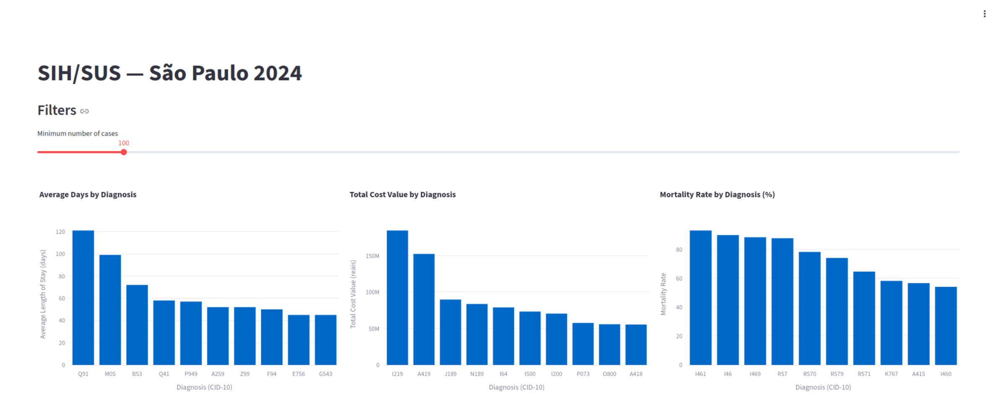
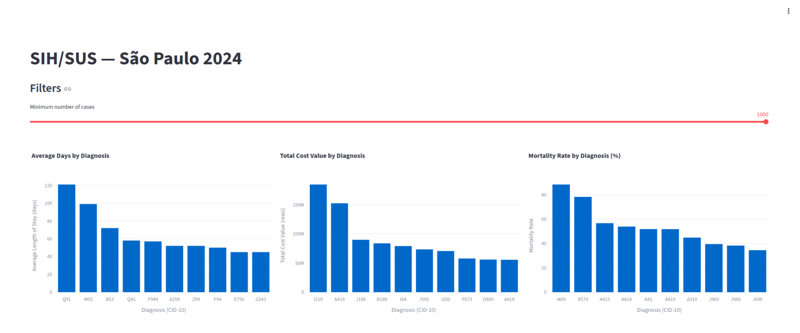

# SUS Lakehouse

A cloud-native data engineering project that ingests Brazilian public hospitalization data from DATASUS (SIH/SUS), transforms it through a medallion architecture, and serves analytics through a public dashboard on Google Cloud Platform.

**Live demo:** https://sus-lakehouse-dashboard-889170445714.southamerica-east1.run.app/

<p align="center">
  
  
</p>

## Architecture

```
                    ┌──────────────────┐
                    │ Cloud Scheduler  │
                    │   (monthly)      │
                    └────────┬─────────┘
                             │ triggers
                             ▼
┌──────────────┐    ┌──────────────────┐    ┌──────────────┐
│   DATASUS    │───▶│  Cloud Run Job   │───▶│  GCS Bucket  │
│   FTP server │    │   (ingestion)    │    │  (raw data)  │
└──────────────┘    └──────────────────┘    └──────┬───────┘
                                                    │
                                                    ▼
                                        ┌────────────────────────┐
                                        │   BigQuery dataset     │
                                        │  ┌──────────────────┐  │
                                        │  │ External table   │  │
                                        │  │  (sih_raw.SP24)  │  │
                                        │  └────────┬─────────┘  │
                                        │           │            │
                                        │           ▼            │
                                        │   dbt transformations  │
                                        │  staging → int → mart  │
                                        └────────────┬───────────┘
                                                     │
                                                     ▼
                                        ┌────────────────────────┐
                                        │  Cloud Run Service     │
                                        │  (Streamlit dashboard) │
                                        └────────────┬───────────┘
                                                     │
                                                     ▼
                                              [public URL]
```

All infrastructure defined as code in `terraform/`.

## What this project does

SUS Lakehouse downloads monthly hospitalization records from Brazil's public health system (SIH/SUS), processes them into clean analytics tables, and exposes three insights through an interactive dashboard:

- **Top diagnoses by average length of stay** — which conditions keep patients hospitalized the longest
- **Top diagnoses by total cost** — where the public health system spends most
- **Top diagnoses by mortality rate** — which conditions are most fatal in hospital settings, with a configurable minimum case threshold

The pipeline currently covers the state of São Paulo for 2024 (~2.8M hospitalization records), with the architecture designed to scale to all 27 Brazilian states and multiple years.

## Tech stack

| Layer | Tools |
|---|---|
| **Ingestion** | Python, `pysus`, Cloud Run Jobs, Cloud Scheduler |
| **Storage** | Google Cloud Storage, BigQuery (external tables) |
| **Transformation** | dbt Core, BigQuery SQL |
| **Visualization** | Streamlit, Plotly, DuckDB |
| **Orchestration** | Cloud Scheduler + Cloud Run Jobs (production), Apache Airflow (development reference) |
| **Infrastructure** | Terraform, Docker, Artifact Registry |
| **Runtime** | Google Cloud Run (Service + Jobs) |

## Project phases

This project was built in five incremental phases, each adding one new tool or concept on top of a working baseline.

### Phase 1 — Local MVP
Downloaded SIH/RD `.dbc` files directly from the DATASUS FTP server, converted them to parquet locally, and built a basic Streamlit dashboard reading from local files. All running on a laptop, no cloud involved.

**Tools added:** Python, `pysus`, `pandas`, `pyarrow`, Streamlit, Plotly

### Phase 2 — Cloud storage
Moved raw parquet files to a GCS bucket and created an external BigQuery table on top, so queries could run against cloud data without copying it. Dashboard refactored to query BigQuery instead of local files.

**Tools added:** Google Cloud Storage, BigQuery, `google-cloud-storage`, `google-cloud-bigquery`

### Phase 3 — Data modeling
Introduced dbt with a medallion architecture: staging models clean and cast raw fields, an intermediate model joins with a CID-10 chapter seed for diagnosis categorization, and three mart tables power the dashboard charts. Added 14 data quality tests and auto-generated documentation.

**Tools added:** dbt Core, dbt-bigquery, DuckDB

### Phase 4 — Orchestration
Set up Apache Airflow locally with Docker Compose to orchestrate the full pipeline (download → upload → BigQuery → dbt). Used `@task.virtualenv` to isolate conflicting dependencies (pysus, dbt) from the Airflow environment. This served as the foundation for production orchestration evaluation.

**Tools added:** Apache Airflow, Docker, Docker Compose

### Phase 5 — Production deployment
Deployed the Streamlit dashboard to Cloud Run, evaluated Cloud Composer for managed Airflow (and tore it down due to cost and FTP network restrictions), and ultimately migrated ingestion to a Cloud Run Job triggered by Cloud Scheduler. All infrastructure codified in Terraform.

**Tools added:** Cloud Run (Service + Jobs), Cloud Scheduler, Cloud Composer (evaluated), Terraform, Artifact Registry

## Setup

### Prerequisites

- [Terraform](https://developer.hashicorp.com/terraform/install) 1.0+
- [Google Cloud SDK](https://cloud.google.com/sdk/docs/install) — `gcloud` CLI
- [Docker](https://docs.docker.com/get-docker/)
- A GCP account with billing enabled

### 1. Clone the repository

```bash
git clone https://github.com/your-username/sus-lakehouse
cd sus-lakehouse
```

### 2. Authenticate with GCP

```bash
gcloud auth login
gcloud auth application-default login
gcloud config set project YOUR-PROJECT-ID
gcloud auth configure-docker southamerica-east1-docker.pkg.dev
```

### 3. Enable required GCP APIs

```bash
gcloud services enable \
    storage.googleapis.com \
    bigquery.googleapis.com \
    run.googleapis.com \
    cloudscheduler.googleapis.com \
    artifactregistry.googleapis.com
```

### 4. Provision infrastructure with Terraform

```bash
cd terraform
cp terraform.tfvars.example terraform.tfvars
# Edit terraform.tfvars with your project_id and bucket_name
terraform init
terraform apply
```

This creates: GCS bucket, BigQuery dataset and external table, Artifact Registry repository, service accounts with least-privilege roles, Cloud Run Job, and the Cloud Scheduler trigger.

### 5. Build and push Docker images

```bash
# Streamlit dashboard
docker build -t southamerica-east1-docker.pkg.dev/YOUR-PROJECT-ID/sus-lakehouse/streamlit:latest dashboard/
docker push southamerica-east1-docker.pkg.dev/YOUR-PROJECT-ID/sus-lakehouse/streamlit:latest

# Ingestion job
docker build -t southamerica-east1-docker.pkg.dev/YOUR-PROJECT-ID/sus-lakehouse/ingestion:latest ingestion/
docker push southamerica-east1-docker.pkg.dev/YOUR-PROJECT-ID/sus-lakehouse/ingestion:latest
```

### 6. Deploy Cloud Run services

```bash
gcloud run deploy sus-lakehouse-dashboard \
    --image=southamerica-east1-docker.pkg.dev/YOUR-PROJECT-ID/sus-lakehouse/streamlit:latest \
    --region=southamerica-east1 \
    --allow-unauthenticated \
    --service-account=streamlit-runner@YOUR-PROJECT-ID.iam.gserviceaccount.com
```

### Local development (optional)

Additional prerequisites:
- Python 3.12+
- [uv](https://docs.astral.sh/uv/getting-started/installation/)

To run the dashboard or dbt locally:

```bash
uv sync
cp dbt/profiles.yml.example dbt/profiles.yml
# Edit dbt/profiles.yml with your local keyfile path
```

## How it works

Once deployed, the pipeline runs automatically:

- **Monthly** — Cloud Scheduler triggers the ingestion job at 10 AM on the 1st of each month
- **The ingestion job** downloads new files from DATASUS FTP, converts `.dbc` → `.parquet`, and uploads to GCS (skipping files already present)
- **BigQuery** reads the parquet files directly via the external table — no copy needed
- **dbt** (run manually for now) transforms the raw data into clean marts
- **The Streamlit dashboard** reads the marts and renders the charts

### Manual operations

Trigger ingestion on demand:

```bash
gcloud run jobs execute sus-lakehouse-ingestion --region=southamerica-east1
```

Run dbt transformations:

```bash
cd dbt && dbt run --target local
cd dbt && dbt test --target local
```

Redeploy the dashboard after code changes:

```bash
docker build -t southamerica-east1-docker.pkg.dev/YOUR-PROJECT-ID/sus-lakehouse/streamlit:latest dashboard/
docker push southamerica-east1-docker.pkg.dev/YOUR-PROJECT-ID/sus-lakehouse/streamlit:latest
gcloud run deploy sus-lakehouse-dashboard --image=southamerica-east1-docker.pkg.dev/YOUR-PROJECT-ID/sus-lakehouse/streamlit:latest --region=southamerica-east1
```

Most of these have shortcuts in the `Makefile`.

## Project structure

```
sus-lakehouse/
├── airflow/              # Local Airflow setup (development reference, see airflow/README.md)
│   ├── dags/             # DAG definitions for Docker and Composer
│   ├── docker-compose.yaml
│   └── Dockerfile
├── dashboard/            # Streamlit dashboard
│   ├── app.py
│   ├── Dockerfile
│   └── requirements.txt
├── dbt/                  # dbt project (medallion architecture)
│   ├── models/
│   │   ├── staging/      # Raw data type-casting and cleaning
│   │   ├── intermediate/ # Business logic and CID-10 joins
│   │   └── mart/         # Final aggregated tables for dashboard
│   ├── seeds/            # Reference data (CID-10 chapters)
│   ├── tests/generic/    # Custom data quality tests
│   └── dbt_project.yml
├── ingestion/            # Cloud Run Job for data ingestion
│   ├── download.py       # FTP → GCS pipeline
│   ├── Dockerfile
│   └── requirements.txt
├── terraform/            # Infrastructure as code
│   ├── main.tf           # All GCP resources
│   ├── variables.tf
│   ├── outputs.tf
│   └── versions.tf
├── docs/                 # Documentation and screenshots
│   ├── dashboard.png
│   ├── dashboard_filtered.png
│   └── dic.pdf           # SIH/RD data dictionary
├── Makefile              # Common command shortcuts
├── pyproject.toml        # Python dependencies (local dev)
└── README.md
```

## Technical decisions & trade-offs

### FTP instead of pysus library for data ingestion

The `pysus` library is the standard Python interface to DATASUS data, but its 2.x API has significant issues: the `sih()` function defaults to the SP (Serviços Profissionais) table instead of the RD (Reduzida) table we needed, async APIs are partially documented, and the `group` parameter doesn't work as documented. Rather than fight the abstraction, the project connects directly to `ftp.datasus.gov.br` and uses `pysus` only for the specialized `.dbc` → parquet conversion (which is genuinely useful and hard to replace).

### External BigQuery tables instead of native tables

Raw data lives in GCS as parquet, and BigQuery reads it via external tables. This avoids duplicating storage (data exists in one place), keeps costs lower (no BigQuery storage charges for raw data), and makes the pipeline cleaner (no separate "load to BigQuery" step). The trade-off is slightly slower queries than native tables, which is acceptable since we only query through dbt-generated marts that aggregate the data anyway.

### Cloud Run Jobs instead of Cloud Composer for ingestion

The project initially used Apache Airflow (local Docker) for orchestration and evaluated Cloud Composer for production. Composer was abandoned for two reasons: cost (~$300/month minimum even when idle) and network restrictions (Composer's managed GKE cluster blocked outbound FTP connections to DATASUS). Cloud Run Jobs cost effectively $0 when not running, have unrestricted network access, and are simpler to operate for a monthly batch job. Airflow code is retained in `airflow/` as documentation of the orchestration journey.

### DuckDB alongside BigQuery in the dashboard

The dashboard loads three small mart tables from BigQuery into pandas DataFrames (cached by Streamlit's `@st.cache_data`) and uses DuckDB to run SQL queries against the cached data in memory. This avoids hitting BigQuery on every user interaction (slider changes, filter updates) while keeping queries written as SQL — making the transition between dbt models and dashboard queries seamless. For larger datasets we'd push more aggregation into dbt marts and let BigQuery handle the heavy lifting.

### Least-privilege service accounts

Each cloud service has its own service account with the minimum permissions required: `ingestion-runner` can only write to GCS, `streamlit-runner` can only read BigQuery, and so on. This limits blast radius if any service is compromised. Service account keys are never used in production — Cloud Run authenticates services via attached identities and Application Default Credentials.

### Manual dbt invocation

dbt currently runs manually rather than on a schedule. The full automation (Cloud Scheduler triggers ingestion → triggers a second Cloud Run Job that runs dbt) would be a natural next step but adds operational complexity that isn't justified for monthly data. For now, contributors run `make dbt-run` after ingestion completes.

## Known limitations

- **Data scope** — Pipeline currently covers São Paulo state for 2024 only (~2.8M records). The architecture supports any state and year via wildcard-based external tables, but the FTP filter is hardcoded to `RDSP24`.

- **Manual dbt execution** — Transformations run on-demand, not on a schedule. After ingestion completes, `make dbt-run` must be executed manually.

- **No incremental loading** — dbt models materialize fully on every run rather than incrementally. Fine for current data volume; would need adjustment at multi-year, multi-state scale.

- **No CI/CD** — Docker images are built and pushed manually. A future GitHub Actions workflow could automate `docker build → push → gcloud run deploy` on every merge to main.

- **Hardcoded GCP identifiers in early commits** — The first few commits contain project ID and bucket name in plain code (since fixed via environment variables). For a real production project these would be scrubbed from git history.

- **Cold starts on the dashboard** — Cloud Run scales to zero when idle, so the first visit after inactivity has ~5-10 second cold start latency.

## Future improvements

- **Expand data scope** — Loop ingestion across all 27 Brazilian states and multiple years. The FTP filter and GCS layout would need to support partitioning (e.g. `state=SP/year=2024/file.parquet`) so BigQuery can prune efficiently.

- **Schedule dbt with the ingestion job** — Add a second Cloud Run Job for dbt and chain them via Cloud Scheduler or Cloud Workflows, so the full pipeline runs end-to-end without human involvement.

- **CI/CD with GitHub Actions** — On push to `main`, automatically build and push Docker images, then trigger `gcloud run deploy`. The dashboard updates within minutes of any code change.

- **Incremental dbt models** — Switch high-volume marts to `materialized='incremental'` so dbt only processes new data each month instead of full rebuilds.

- **More dashboard insights** — Add charts for regional disparities (by state/municipality), demographic breakdowns (age, sex, race), temporal trends, and procedure-level analysis.

- **Custom domain for the dashboard** — Map a friendly URL via Cloud DNS instead of the auto-generated `*.run.app`.