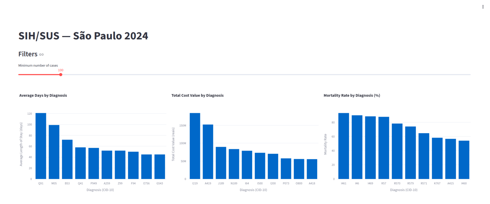
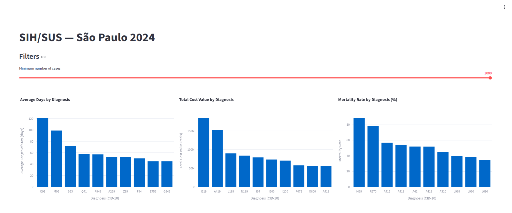

# SUS Lakehouse

A cloud-native data engineering project that ingests Brazilian public hospitalization data from DATASUS (SIH/SUS), enriches it with reference data from IBGE (state population and IPCA inflation index), transforms it through a medallion architecture, and serves analytics through a public dashboard on Google Cloud Platform.

**Live demo:** https://sus-lakehouse-dashboard-889170445714.southamerica-east1.run.app/

<p align="center">
  
  
</p>

## Architecture

```
                    ┌──────────────────┐
                    │ Cloud Scheduler  │
                    │   (monthly x2)   │
                    └────┬─────────┬───┘
                         │         │
       ┌─────────────────┘         └──────────────────┐
       ▼                                              ▼
┌──────────────┐                              ┌──────────────┐
│   DATASUS    │                              │  IBGE SIDRA  │
│   FTP server │                              │      API     │
└──────┬───────┘                              └──────┬───────┘
       │                                             │
       ▼                                             ▼
┌──────────────────┐                          ┌──────────────────┐
│  Cloud Run Job   │                          │  Cloud Run Job   │
│  (SIH ingestion) │                          │ (reference data) │
└──────┬───────────┘                          └──────┬───────────┘
       │                                             │
       └─────────────────────┬───────────────────────┘
                             ▼
                     ┌──────────────┐
                     │  GCS Bucket  │
                     │  (raw data)  │
                     └──────┬───────┘
                            │
                            ▼
                ┌────────────────────────┐
                │   BigQuery dataset     │
                │  ┌──────────────────┐  │
                │  │ External tables  │  │
                │  │  - internacoes   │  │
                │  │  - population    │  │
                │  │  - ipca_monthly  │  │
                │  └────────┬─────────┘  │
                │           │            │
                │           ▼            │
                │   dbt transformations  │
                │  staging → int → mart  │
                └────────────┬───────────┘
                             │
                             ▼
                ┌────────────────────────┐
                │  Cloud Run Service     │
                │  (Streamlit dashboard) │
                └────────────┬───────────┘
                             │
                             ▼
                       [public URL]
```

All infrastructure defined as code in `terraform/`.

## What this project does

SUS Lakehouse downloads monthly hospitalization records from Brazil's public health system (SIH/SUS), enriches them with official IBGE reference data (state population and monthly IPCA inflation index), processes everything into clean analytics tables, and exposes the results through an interactive dashboard.

The dashboard currently surfaces five insights:

- **Top diagnoses by average length of stay** — which conditions keep patients hospitalized the longest
- **Top diagnoses by total cost** — where the public health system spends most, adjusted for inflation using the IPCA index
- **Top diagnoses by mortality rate** — which conditions are most fatal in hospital settings, with a configurable minimum-cases threshold
- **Trends over time** — timeseries chart with selectable metric (hospitalizations, deaths, cost, mortality rate), granularity (year/month), and state comparison mode
- **Hospitalizations by state** — per-100k-inhabitants comparison across all Brazilian states

The pipeline currently covers all 27 Brazilian states, with ingestion pulling SIH files from 2025 processing months onwards. Older `admission_year` values that appear in the data represent long-stay or reprocessed cases carried into 2025 files rather than full historical cohorts (see Known limitations).

## Tech stack

| Layer | Tools |
|---|---|
| **Ingestion** | Python, `pysus`, `requests` (IBGE SIDRA API), Cloud Run Jobs, Cloud Scheduler |
| **Storage** | Google Cloud Storage, BigQuery (external tables) |
| **Transformation** | dbt Core, BigQuery SQL |
| **Visualization** | Streamlit, Plotly |
| **Orchestration** | Cloud Scheduler + Cloud Run Jobs (production), Apache Airflow (development reference) |
| **Infrastructure** | Terraform, Docker, Artifact Registry |
| **Runtime** | Google Cloud Run (Service + Jobs) |

## dbt models

The transformation layer follows the medallion pattern with three tiers:

**Staging** (`stg_*`) — type casting, column standardization, cleanup:
- `stg_sih_rd` — hospitalization records
- `stg_state_population` — annual state population from IBGE
- `stg_ipca_monthly` — monthly IPCA inflation index from IBGE

**Intermediate** (`int_*`) — business logic and enrichment:
- `int_internacoes` — hospitalizations joined with CID-10 chapters, inflation-adjusted costs (`val_tot_corrected`), and state population attached

**Marts** — final aggregated tables powering the dashboard:
- `mart_avg_length_of_stay` — average hospitalization days by diagnosis, state, year
- `mart_total_cost` — total inflation-adjusted cost by diagnosis, state, year
- `mart_mortality_rate` — mortality rate by diagnosis with case-count guardrails
- `mart_monthly_trend` — monthly hospitalizations, deaths, and cost by state (feeds the timeseries chart)
- `mart_hospitalizations_by_state` — hospitalizations per 100k inhabitants by state and year

All marts include `data_tests` in `schema.yml` — `not_null`, `strictly_positive`, `accepted_values` for known enumerations (state UF codes, months) — validated on every `dbt test` run.

## Project phases

This project was built in six incremental phases, each adding one new tool or concept on top of a working baseline.

### Phase 1 — Local MVP
Downloaded SIH/RD `.dbc` files directly from the DATASUS FTP server, converted them to parquet locally, and built a basic Streamlit dashboard reading from local files. All running on a laptop, no cloud involved.

**Tools added:** Python, `pysus`, `pandas`, `pyarrow`, Streamlit, Plotly

### Phase 2 — Cloud storage
Moved raw parquet files to a GCS bucket and created an external BigQuery table on top, so queries could run against cloud data without copying it. Dashboard refactored to query BigQuery instead of local files.

**Tools added:** Google Cloud Storage, BigQuery, `google-cloud-storage`, `google-cloud-bigquery`

### Phase 3 — Data modeling
Introduced dbt with a medallion architecture: staging models clean and cast raw fields, an intermediate model joins with a CID-10 chapter seed for diagnosis categorization, and mart tables power the dashboard charts. Added data quality tests and auto-generated documentation.

**Tools added:** dbt Core, dbt-bigquery

### Phase 4 — Orchestration
Set up Apache Airflow locally with Docker Compose to orchestrate the full pipeline (download → upload → BigQuery → dbt). Used `@task.virtualenv` to isolate conflicting dependencies (pysus, dbt) from the Airflow environment. This served as the foundation for evaluating production orchestration options.

**Tools added:** Apache Airflow, Docker, Docker Compose

### Phase 5 — Production deployment
Deployed the Streamlit dashboard to Cloud Run, evaluated Cloud Composer for managed Airflow (and tore it down due to cost and FTP network restrictions), and ultimately migrated ingestion to a Cloud Run Job triggered by Cloud Scheduler. All infrastructure codified in Terraform.

**Tools added:** Cloud Run (Service + Jobs), Cloud Scheduler, Cloud Composer (evaluated), Terraform, Artifact Registry

### Phase 6 — Reference data enrichment
Added a second Cloud Run Job that pulls state population estimates and monthly IPCA inflation index from the IBGE SIDRA API, on its own monthly schedule. Extended the dbt intermediate model to inflation-adjust hospitalization costs into `val_tot_corrected` (so year-over-year cost comparisons are meaningful in real terms) and to attach state population (so hospitalization volumes can be normalized per 100k inhabitants). New marts `mart_monthly_trend` and `mart_hospitalizations_by_state` were built on top, powering the timeseries chart and the per-state chart on the dashboard.

**Tools added:** IBGE SIDRA API, second Cloud Run Job pipeline

## Setup

### Prerequisites

- [Terraform](https://developer.hashicorp.com/terraform/install) 1.0+
- [Google Cloud SDK](https://cloud.google.com/sdk/docs/install) — `gcloud` CLI
- [Docker](https://docs.docker.com/get-docker/)
- A GCP account with billing enabled

### 1. Clone the repository

```bash
git clone https://github.com/your-username/sus-lakehouse
cd sus-lakehouse
```

### 2. Authenticate with GCP

```bash
gcloud auth login
gcloud auth application-default login
gcloud config set project YOUR-PROJECT-ID
gcloud auth configure-docker southamerica-east1-docker.pkg.dev
```

### 3. Enable required GCP APIs

```bash
gcloud services enable \
    storage.googleapis.com \
    bigquery.googleapis.com \
    run.googleapis.com \
    cloudscheduler.googleapis.com \
    artifactregistry.googleapis.com
```

### 4. Provision infrastructure with Terraform

```bash
cd terraform
cp terraform.tfvars.example terraform.tfvars
# Edit terraform.tfvars with your project_id and bucket_name
terraform init
terraform apply
```

This creates: GCS bucket, BigQuery dataset and external tables, Artifact Registry repository, service accounts with least-privilege roles, two Cloud Run Jobs (SIH ingestion and reference data ingestion), Cloud Scheduler triggers for both, and the dashboard Cloud Run service.

### 5. Build and push Docker images

```bash
# Streamlit dashboard
docker build -t southamerica-east1-docker.pkg.dev/YOUR-PROJECT-ID/sus-lakehouse/streamlit:latest dashboard/
docker push southamerica-east1-docker.pkg.dev/YOUR-PROJECT-ID/sus-lakehouse/streamlit:latest

# SIH ingestion job
docker build -t southamerica-east1-docker.pkg.dev/YOUR-PROJECT-ID/sus-lakehouse/ingestion:latest ingestion/
docker push southamerica-east1-docker.pkg.dev/YOUR-PROJECT-ID/sus-lakehouse/ingestion:latest

# Reference data ingestion job
docker build -t southamerica-east1-docker.pkg.dev/YOUR-PROJECT-ID/sus-lakehouse/reference-ingestion:latest ingestion-reference/
docker push southamerica-east1-docker.pkg.dev/YOUR-PROJECT-ID/sus-lakehouse/reference-ingestion:latest
```

### 6. Deploy Cloud Run services

```bash
gcloud run deploy sus-lakehouse-dashboard \
    --image=southamerica-east1-docker.pkg.dev/YOUR-PROJECT-ID/sus-lakehouse/streamlit:latest \
    --region=southamerica-east1 \
    --allow-unauthenticated \
    --service-account=streamlit-runner@YOUR-PROJECT-ID.iam.gserviceaccount.com
```

### Local development (optional)

Additional prerequisites:
- Python 3.12+
- [uv](https://docs.astral.sh/uv/getting-started/installation/)

To run the dashboard or dbt locally:

```bash
uv sync
cp dbt/profiles.yml.example dbt/profiles.yml
# Edit dbt/profiles.yml with your local keyfile path
```

## How it works

Once deployed, the pipeline runs automatically:

- **Monthly (SIH)** — Cloud Scheduler triggers the SIH ingestion job on the 1st of each month. The job downloads new files from DATASUS FTP, converts `.dbc` → `.parquet`, and uploads them to GCS (skipping files already present).
- **Monthly (Reference data)** — A second Cloud Scheduler triggers the reference data ingestion job on the same cadence. It fetches state population and IPCA index from the IBGE SIDRA API and writes them as parquet to GCS.
- **BigQuery** reads both raw datasets directly via external tables — no copy needed.
- **dbt** (run manually for now) transforms the raw data through staging → intermediate → marts, applying inflation adjustments and population normalization along the way.
- **The Streamlit dashboard** reads the marts and renders the five charts.

### Manual operations

Trigger ingestion on demand:

```bash
gcloud run jobs execute sus-lakehouse-ingestion --region=southamerica-east1
gcloud run jobs execute sus-lakehouse-reference-ingestion --region=southamerica-east1
```

Run dbt transformations:

```bash
cd dbt && dbt run --target local
cd dbt && dbt test --target local
```

Redeploy the dashboard after code changes:

```bash
docker build -t southamerica-east1-docker.pkg.dev/YOUR-PROJECT-ID/sus-lakehouse/streamlit:latest dashboard/
docker push southamerica-east1-docker.pkg.dev/YOUR-PROJECT-ID/sus-lakehouse/streamlit:latest
gcloud run deploy sus-lakehouse-dashboard --image=southamerica-east1-docker.pkg.dev/YOUR-PROJECT-ID/sus-lakehouse/streamlit:latest --region=southamerica-east1
```

Most of these have shortcuts in the `Makefile`.

## Project structure

```
sus-lakehouse/
├── airflow/                 # Local Airflow setup (development reference, see airflow/README.md)
│   ├── dags/                # DAG definitions for Docker and Composer
│   ├── docker-compose.yaml
│   └── Dockerfile
├── dashboard/               # Streamlit dashboard
│   ├── app.py
│   ├── Dockerfile
│   └── requirements.txt
├── dbt/                     # dbt project (medallion architecture)
│   ├── models/
│   │   ├── staging/         # Raw data type-casting and cleaning
│   │   ├── intermediate/    # Business logic, CID-10 joins, inflation adjustment
│   │   └── mart/            # Final aggregated tables for dashboard
│   ├── seeds/               # Reference data (CID-10 chapters)
│   ├── tests/generic/       # Custom data quality tests
│   └── dbt_project.yml
├── ingestion/               # Cloud Run Job for SIH ingestion
│   ├── download.py          # FTP → GCS pipeline
│   ├── Dockerfile
│   └── requirements.txt
├── ingestion-reference/     # Cloud Run Job for IBGE reference data
│   ├── download_reference.py  # SIDRA API → GCS pipeline
│   ├── Dockerfile
│   └── requirements.txt
├── terraform/               # Infrastructure as code
│   ├── main.tf              # All GCP resources
│   ├── variables.tf
│   ├── outputs.tf
│   └── versions.tf
├── docs/                    # Documentation and screenshots
│   ├── dashboard.png
│   ├── dashboard_filtered.png
│   └── dic.pdf              # SIH/RD data dictionary
├── Makefile                 # Common command shortcuts
├── pyproject.toml           # Python dependencies (local dev)
├── uv.lock                  # Lockfile
└── README.md
```

## Technical decisions & trade-offs

### FTP instead of pysus library for data ingestion

The `pysus` library is the standard Python interface to DATASUS data, but its 2.x API has significant issues: the `sih()` function defaults to the SP (Serviços Profissionais) table instead of the RD (Reduzida) table we needed, async APIs are partially documented, and the `group` parameter doesn't work as documented. Rather than fight the abstraction, the project connects directly to `ftp.datasus.gov.br` and uses `pysus` only for the specialized `.dbc` → parquet conversion (which is genuinely useful and hard to replace).

### External BigQuery tables instead of native tables

Raw data lives in GCS as parquet, and BigQuery reads it via external tables. This avoids duplicating storage (data exists in one place), keeps costs lower (no BigQuery storage charges for raw data), and makes the pipeline cleaner (no separate "load to BigQuery" step). The trade-off is slightly slower queries than native tables, which is acceptable since we only query through dbt-generated marts that aggregate the data anyway.

### Inflation-adjusted costs from Phase 6 onwards

Nominal hospitalization costs (`val_tot` in the SIH data) can't be meaningfully compared across years because Brazilian inflation shifts the real value of the currency. The intermediate model uses the monthly IPCA index to normalize each record's cost to a common reference month, producing `val_tot_corrected` — a cost in constant reais. This is why the dashboard's "total cost" chart is inflation-adjusted and why year-over-year comparisons in the timeseries chart are meaningful.

### Cloud Run Jobs instead of Cloud Composer for ingestion

The project initially used Apache Airflow (local Docker) for orchestration and evaluated Cloud Composer for production. Composer was abandoned for two reasons: cost (~$300/month minimum even when idle) and network restrictions (Composer's managed GKE cluster blocked outbound FTP connections to DATASUS). Cloud Run Jobs cost effectively $0 when not running, have unrestricted network access, and are simpler to operate for a monthly batch job. Airflow code is retained in `airflow/` as documentation of the orchestration journey.

### Least-privilege service accounts

Each cloud service has its own service account with the minimum permissions required: `ingestion-runner` can only write to GCS, `streamlit-runner` can only read BigQuery, and so on. This limits blast radius if any service is compromised. Service account keys are never used in production — Cloud Run authenticates services via attached identities and Application Default Credentials.

### Manual dbt invocation

dbt currently runs manually rather than on a schedule. The full automation (Cloud Scheduler triggers ingestion → triggers a third Cloud Run Job that runs dbt) would be a natural next step but adds operational complexity that isn't justified for monthly data. For now, contributors run `make dbt-run` after ingestion completes.

## Known limitations

- **Admission date vs. processing date semantics** — The ingestion pulls SIH files from 2025 onwards, since SIH files are organized by processing/billing month rather than by admission date. Some records within those files reference admissions from prior years — typically long-stay hospitalizations or reprocessed cases. As a result, `admission_year` values before 2025 exist in the data but represent a biased subset (long-stay patients are overrepresented) and should not be interpreted as full-year cohorts.

- **Manual dbt execution** — Transformations run on-demand, not on a schedule. After ingestion completes, `make dbt-run` must be executed manually.

- **No incremental loading** — dbt models materialize fully on every run rather than incrementally. Fine for current data volume; would need adjustment as the historical backfill grows.

- **No CI/CD** — Docker images are built and pushed manually. A future GitHub Actions workflow could automate `docker build → push → gcloud run deploy` on every merge to main.

- **Hardcoded GCP identifiers in early commits** — The first few commits contain project ID and bucket name in plain code (since fixed via environment variables). For a real production project these would be scrubbed from git history.

- **Cold starts on the dashboard** — Cloud Run scales to zero when idle, so the first visit after inactivity has ~5-10 second cold start latency.

## Future improvements

- **Historical backfill** — Extend the ingestion to also pull SIH files from years before 2025 (currently the filter starts at 2025 processing months). This would give complete admission-year cohorts for retrospective analysis, at the cost of additional storage and dbt processing time.

- **Schedule dbt with the ingestion jobs** — Add a third Cloud Run Job for dbt and chain them via Cloud Workflows so the full pipeline runs end-to-end without human involvement.

- **CI/CD with GitHub Actions** — On push to `main`, automatically build and push Docker images, then trigger `gcloud run deploy`. The dashboard updates within minutes of any code change.

- **Incremental dbt models** — Switch high-volume marts to `materialized='incremental'` so dbt only processes new data each month instead of full rebuilds.

- **Choropleth map of hospitalizations by state** — Add a Brazil choropleth to the dashboard using the `mart_hospitalizations_by_state` per-100k metric.

- **More dashboard insights** — Demographic breakdowns (age, sex, race), procedure-level analysis, and drill-downs by state or diagnosis chapter.

- **Custom domain for the dashboard** — Map a friendly URL via Cloud DNS instead of the auto-generated `*.run.app`.